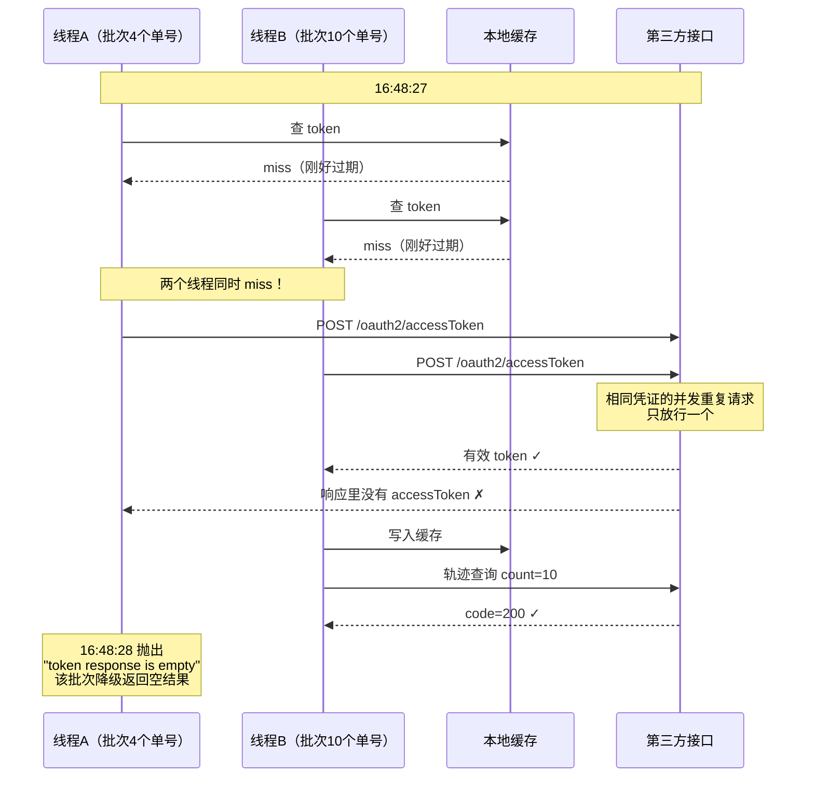
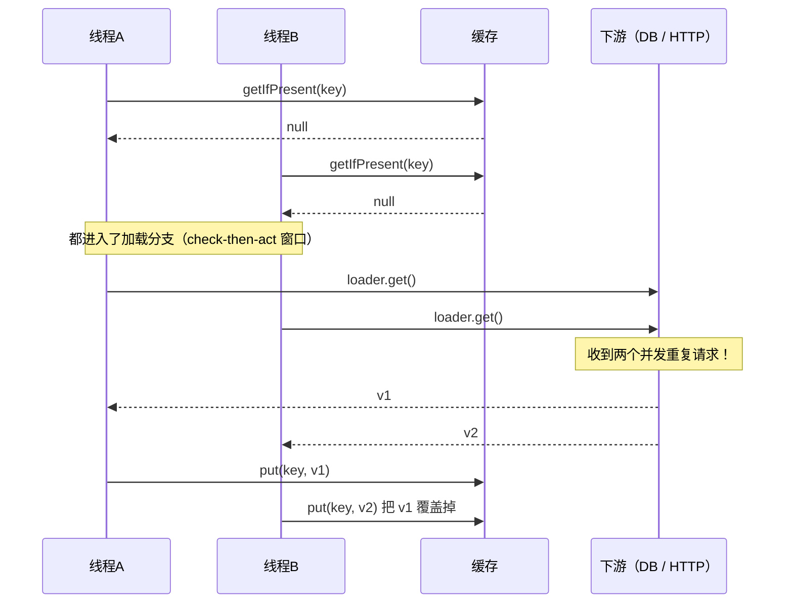
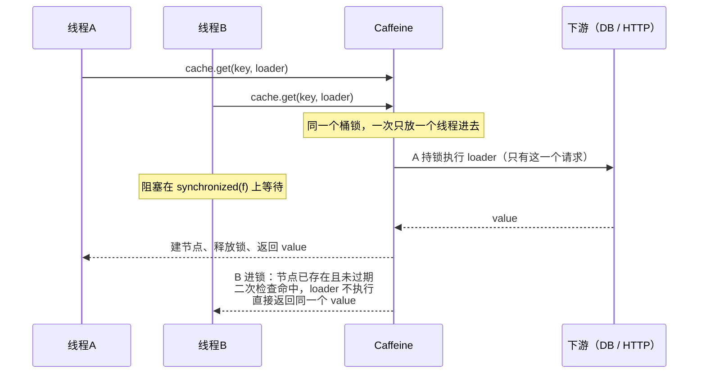
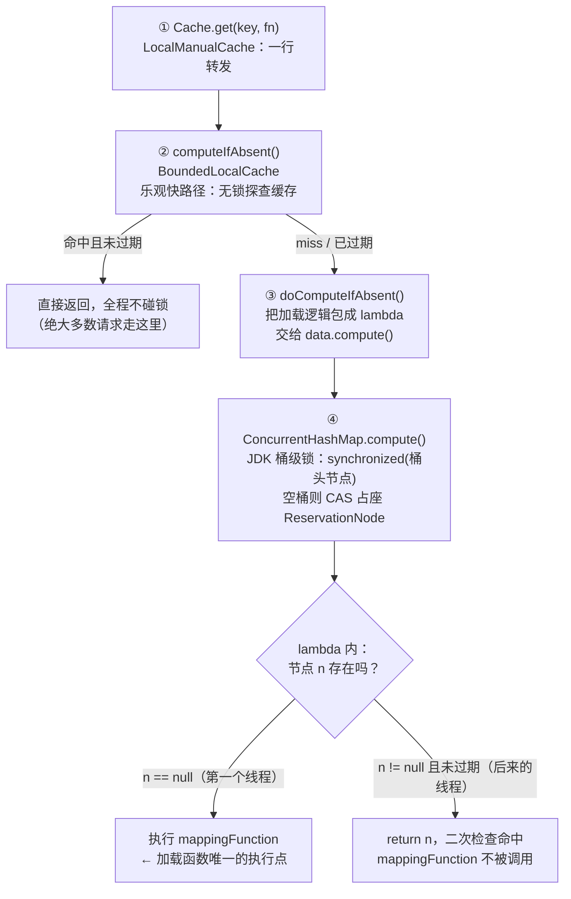

前阵子线上出了一个很有意思的偶发报错：一个对接第三方物流开放平台的查询服务，一天几十次调用里只有一次失败，报 `token response is empty`，之后 30 天再没复现。顺着日志和源码查下来，根因是一个非常经典的并发问题——**手写缓存的 check-then-act 竞态**。而修复它，只需要把两行代码换成 Caffeine 的一个方法调用。

这篇就借这个案例，把 Caffeine 的常用姿势和多线程下真正需要注意的东西整理一遍：先讲基本用法，再讲竞态是怎么发生的，然后深入源码看 `cache.get(key, fn)` 是怎么做到"加载函数只执行一次"的，最后是一份踩坑清单。

> 文中场景经过改编脱敏：隐去了公司、服务与第三方厂商名称，接口一律用 `api.example.com` 代替，代码为示意版本。排查过程基于 Caffeine 3.1.8 与 JDK 17。

## 事故现场

系统需要调用第三方的物流轨迹查询接口。调用前要先拿 OAuth token：

```
POST https://api.example.com/oauth2/accessToken
Content-Type: application/x-www-form-urlencoded

appId=xxx&secret=xxx&grantType=password
```

token 有效期十几分钟，所以代码里用了一个本地缓存（Caffeine）来存它，过期了再取新的。逻辑大致是这样：

```java
public <T> T getTokenWithCache(String key, Supplier<T> loader, Duration ttl) {
    CachedToken cached = cache.getIfPresent(key);
    if (cached != null && !cached.isExpired(ttl)) {
        return (T) cached.getToken();          // 缓存命中，直接返回
    }
    T token = loader.get();                    // ★ 未命中，去第三方取
    if (token != null) {
        cache.put(key, new CachedToken(token));
    }
    return token;
}
```

单线程看毫无问题。出事那天的日志时间线是这样的（同一个 pod、两个工作线程）：



两个线程在缓存过期的同一瞬间各自向第三方发起了 token 请求（相同的 appId + secret，前后脚不到一秒）。第三方对这种并发重复请求只放行一个：一个线程拿到了有效 token，另一个拿到的响应里没有 token 字段——SDK 一判 `accessToken == null`，抛出了那句 `token response is empty`。

30 天只出现一次，是因为触发需要两个条件同时成立：**缓存恰好过期** + **恰好有并发请求同时打进来**。概率低，但确定性地会复现，流量越大越容易撞上。

问题的本质，就是那句被念烂了的话：**check-then-act（先检查再行动）不是原子的**。`getIfPresent()` 和 `put()` 之间的窗口里，任意多个线程都可以挤进来。

## 先把基本功补齐：Caffeine 是什么、怎么用

[Caffeine](https://github.com/ben-manes/caffeine) 是 Java 生态里事实标准的本地缓存库（Spring Boot 的 `spring-boot-starter-cache` 默认推荐的就是它），核心卖点是 W-TinyLFU 淘汰算法带来的高命中率，以及接近 `ConcurrentHashMap` 的读写性能。

引入依赖：

```xml
<dependency>
    <groupId>com.github.ben-manes.caffeine</groupId>
    <artifactId>caffeine</artifactId>
    <version>3.1.8</version>
</dependency>
```

最小可用的例子：

```java
Cache<String, Token> cache = Caffeine.newBuilder()
        .maximumSize(100)                              // 最多存 100 个 entry，超出按 W-TinyLFU 淘汰
        .expireAfterWrite(Duration.ofMinutes(8))       // 写入 8 分钟后过期
        .recordStats()                                 // 打开命中率等统计
        .build();

// 手动读写
Token t = cache.getIfPresent("api-token");   // 没有则返回 null
cache.put("api-token", newToken);
cache.invalidate("api-token");

// 统计（需要 recordStats()）
cache.stats().hitRate();
```

几个最常用的 builder 选项：

| 选项 | 作用 | 备注 |
|---|---|---|
| `maximumSize(n)` | 容量上限 | 到了上限按 W-TinyLFU 淘汰"最不值得留"的 entry |
| `expireAfterWrite(d)` | 写入后 d 时间过期 | 最常用，适合 token、配置这类"到点必须换新"的数据 |
| `expireAfterAccess(d)` | 最后一次读/写后 d 时间过期 | 适合"没人用就清掉"的会话类数据 |
| `refreshAfterWrite(d)` | 写入 d 时间后**异步刷新** | 刷新期间旧值继续可用，见后文 |
| `removalListener(l)` | entry 被移除时回调 | 注意回调是异步执行的 |
| `recordStats()` | 记录命中/淘汰统计 | 生产环境建议开，命中率是缓存是否有用的唯一判据 |

到这里都是常规操作。真正的分水岭在下一节：**多线程环境下，"先查再写"的正确姿势**。

## 错误姿势：getIfPresent + put

回到开头那段代码，它的时序在并发下会展开成这样：



后果分三档：

1. **最轻**：加载是幂等的（比如查数据库），只是浪费了一次调用；
2. **中等**：加载有副作用（比如扣减、发请求创建资源），重复执行直接产生脏数据；
3. **最重**（本次事故）：第三方对并发重复请求做了限制，后到的那个直接失败——用户看到的就是一个莫名其妙的偶发报错。

这类问题有个专门的名字：**缓存击穿 / cache stampede**（也叫 dog-piling）：热点 key 过期的一瞬间，所有并发请求同时穿透缓存打到下游。

## 正确姿势：cache.get(key, mappingFunction)

Caffeine 早就把这个问题解决了，就是那个看起来平平无奇的方法：

```java
Token token = cache.get("api-token", key -> fetchTokenFromRemote());
```

它的 javadoc 契约写得非常明确（`com.github.benmanes.caffeine.cache.Cache#get`）：

> The entire method invocation is performed **atomically**, so the function is **applied at most once per key**. Some attempted update operations on this cache by other threads **may be blocked** while the computation is in progress, so the computation should be **short and simple**, and must not attempt to update any other mappings of this cache.

三个关键词：

- **atomically**：整个调用是原子的，不存在"查到没有→别人插入→我又插入"的窗口；
- **at most once per key**：同一个 key 的加载函数最多被执行一次，并发的其他线程**阻塞等待**，然后直接拿到第一个线程算出来的值；
- **may be blocked**：等待是真的线程阻塞，所以加载函数要短——这点后面细说，是整个方案里最重要的注意事项。

并发时序变成：



好比一个只开一个窗口的售票处：第二个人不会跑到另一个窗口重复买票，而是排队等第一个人买完，直接拿结果。

用这一行替换掉手写的 `getIfPresent + put`，事故里的并发双取 token 就不可能发生了。

## 源码 walkthrough："只执行一次"是怎么做到的

javadoc 的承诺不是魔法。翻开 Caffeine 3.1.8 的源码，整条链路其实就四层，最终的互斥能力是**借 ConcurrentHashMap 的桶级锁**实现的：



**第一层：入口转发。** `Cache.get(key, fn)` 的默认实现（`LocalManualCache`）就一行：

```java
@Override
default @Nullable V get(K key, Function<? super K, ? extends V> mappingFunction) {
    return cache().computeIfAbsent(key, mappingFunction);
}
```

**第二层：乐观快路径。** `BoundedLocalCache.computeIfAbsent()` 先无锁地探一下缓存——命中且未过期就直接返回，绝大多数请求在这里就结束了，根本不碰锁：

```java
// An optimistic fast path to avoid unnecessary locking
Node<K, V> node = data.get(nodeFactory.newLookupKey(key));
if (node != null) {
    V value = node.getValue();
    if ((value != null) && !hasExpired(node, now)) {
        // ... 更新访问时间、统计
        return value;
    }
}
return doComputeIfAbsent(key, keyRef, mappingFunction, ...);
```

**第三层：委托给 ConcurrentHashMap.compute()。** `doComputeIfAbsent()` 里的核心一行：

```java
// data 就是 Caffeine 内部持有的那个 ConcurrentHashMap
Node<K, V> node = data.compute(keyRef, (k, n) -> {
    if (n == null) {                                  // 桶里还没有这个 key 的节点
        newValue[0] = mappingFunction.apply(key);     // ★ 加载函数在这里执行
        if (newValue[0] == null) return null;
        return nodeFactory.newNode(...);              // 建节点
    }
    synchronized (n) {                                // 节点已存在（可能是别人刚建的）
        if (!hasExpired(n, now[0])) {
            return n;                                 // ★ 二次检查：没过期就直接返回，
        }                                             //   不再调用 mappingFunction！
        newValue[0] = mappingFunction.apply(key);     // 确实过期了才重新加载
        ...
    }
});
```

**第四层：JDK 的桶级锁。** `ConcurrentHashMap.compute()`（JDK 17 源码 1897 行起）对 key 所在的**哈希桶**加 `synchronized`：

```java
// 桶是空的：CAS 放入一个 ReservationNode"占座"，并持有它的 monitor
Node<K,V> r = new ReservationNode<K,V>();
synchronized (r) {
    if (casTabAt(tab, i, null, r)) {
        val = remappingFunction.apply(key, null);   // ← 持锁执行 Caffeine 传进来的 lambda
        ...
    }
}
// 桶非空：直接锁桶头节点
synchronized (f) {
    if (tabAt(tab, i) == f) {
        val = remappingFunction.apply(key, e.val);  // ← 同上
        ...
    }
}
```

把四层串起来，两个线程并发 `cache.get(同一个key, loader)` 的完整过程：

1. 两个线程都通过乐观快路径（都发现缓存没有/过期）；
2. 都进入 `data.compute()`，**线程 A 先抢到桶锁**（或空桶的 ReservationNode monitor），开始执行 Caffeine 的 lambda：`n == null` → 调用 `loader` 发 HTTP → 建节点 → 释放锁；
3. **线程 B 全程阻塞在 `synchronized (f)` 上**——这就是 javadoc 里 "may be blocked" 的出处；
4. A 释放锁后，B 进入 lambda，此时 `n != null`（A 刚建的节点）且未过期，走 `synchronized (n)` 里的二次检查，`return n`——**loader 一次都不会被 B 调用**；
5. B 在 `doComputeIfAbsent` 的收尾逻辑里返回 A 算出来的值。

所以"每个 key 的加载函数最多执行一次"的保证 = **CHM 的桶级 synchronized（互斥） + Caffeine 在锁内的二次检查（避免重复加载）**。Caffeine 官方 wiki 对这个问题也有专门条目（[Compute](https://github.com/ben-manes/caffeine/wiki/Compute)），结论一致。

## 踩坑清单：五个必须知道的注意事项

### 1. 锁粒度是"桶"，不是"key"

`synchronized (f)` 锁的是哈希桶的头节点。落在同一个桶里的**不同 key**，加载时也会互相阻塞。绝大多数场景（比如按用户 ID、按 provider 名缓存）这无所谓；但如果你的 key 空间很大且加载都很慢，理论上会有无关 key 之间的排队。知道这回事就行，很少需要为它改设计。

### 2. 加载函数是持锁执行的——必须短，必须配超时

这是整个方案里**最重要**的一条。你的 HTTP 调用每执行一毫秒，桶锁就被占一毫秒。如果加载函数里那个 HTTP 客户端**没配超时**（很多代码都是裸的 `RestClient.builder().baseUrl(...).build()`），一旦对端挂起，这个桶上的所有写操作就永久卡死，而且线程池会被逐渐吃光——比原来的竞态 bug 严重得多。

所以用 `cache.get(key, fn)` 做互斥加载时，配套动作是：

```java
// 给加载用的 HTTP 客户端配上超时
requestConfig.setConnectTimeout(Timeout.ofSeconds(5));
requestConfig.setResponseTimeout(Timeout.ofSeconds(10));
```

javadoc 那句 "the computation should be short and simple" 不是客套话，是使用条件。

### 3. 加载函数里不要递归更新同一个缓存

CHM 会直接抛 `IllegalStateException: Recursive update`，或者死锁。Caffeine 的 javadoc 也用加粗的 **must not** 强调了这点。加载函数里再去 `cache.put()` 别的 key、或者再调同一个 cache 的 `get()`，都是雷。

### 4. 加载函数抛异常时的行为：不缓存坏值，等待者串行重试

lambda 里抛出的异常会向上传播给调用线程，节点不会被创建。此时阻塞在桶锁上的下一个线程会进锁、发现 `n == null`、**自己再执行一次加载**——相当于天然的串行重试。这个行为通常是合理的：瞬时故障（网络抖动）被第二个线程自愈；持续故障则每个线程各失败一次，不会缓存住一个坏 token。

### 5. 加载进行中，getIfPresent 读到的是 null

线程 A 持锁加载时，桶里放的是 `ReservationNode`（占位节点，`find()` 永远返回 null）。此时线程 B 调 `getIfPresent(key)` 不会阻塞，但会拿到 `null`。所以**不要把 `getIfPresent` 和 `get(key, fn)` 混着用**来表达同一个语义——统一走 `get(key, fn)`，让 Caffeine 替你排队。

## 延伸：refreshAfterWrite，另一种防击穿思路

`get(key, fn)` 的策略是"**过期后第一个请求持锁加载，其他人阻塞等**"。如果业务能容忍短暂读到旧值，还有一个体验更好的选项：`refreshAfterWrite`。

```java
LoadingCache<String, Token> cache = Caffeine.newBuilder()
        .maximumSize(100)
        .expireAfterWrite(Duration.ofMinutes(13))     // 硬过期：到点必须重新加载
        .refreshAfterWrite(Duration.ofMinutes(8))     // 软过期：到点异步刷新
        .build(key -> fetchTokenFromRemote());        // LoadingCache 需要 CacheLoader
```

行为差异：写入 8 分钟后，某个请求读到这个 key 时，**立即返回旧值**，同时提交一个异步任务去重新加载；刷新完成前，其他请求继续用旧值。没有任何请求会被阻塞，天然免疫缓存击穿。

三种过期策略怎么选：

| 策略 | 过期后读到什么 | 谁来加载 | 适用 |
|---|---|---|---|
| `expireAfterWrite` + `get(key,fn)` | 阻塞等新值 | 第一个到达的线程（持锁） | 数据不能旧（token、余额） |
| `refreshAfterWrite` | 立即返回旧值 | 后台异步（默认 ForkJoinPool） | 能容忍秒级陈旧（推荐列表、配置） |
| `expireAfterAccess` | 阻塞等新值 | 同上 | 冷数据自动清理（会话） |

注意 `refreshAfterWrite` 需要 `LoadingCache`（构建时给 `CacheLoader`），而 `Cache.get(key, fn)` 手动缓存就能用；两者也可以叠加——refresh 负责"平峰不阻塞"，expire 负责"陈旧度上限"。

## 事故复盘：修复清单

回到开头的竞态，完整的修复是四件事，按优先级：

1. **并发保护**（治本）：`getTokenWithCache` 内部的 `getIfPresent + put` 换成 `cache.get(key, k -> load())`，靠 CHM 桶锁实现 single-flight；
2. **超时**（保命）：token 请求的 HTTP 客户端补上 connect/response 超时——持锁加载的前提是"锁最多被占一个超时的时间"；
3. **日志**（可观测）：判空抛异常之前，把第三方的原始响应记下来。这次排查最大的障碍就是错误信息只有一句 "response is empty"，对方到底返回了什么错误码，永远丢失了；
4. **重试**（兜底）：token 获取失败时重试一次。有了 1 的保护，重试不会放大并发，只是给瞬时故障一次自愈机会。

三条经验，适用于所有"缓存 + 远程加载"的场景：

- **永远不要手写 check-then-act 的缓存读写**。你觉得"就两行，能有什么问题"的窗口，就是并发 bug 的窗口。用库给你的原子原语：Caffeine 的 `get(key, fn)`、`ConcurrentHashMap.computeIfAbsent`、Guava 的 `LoadingCache`，都是一个意思；
- **第三方调用必须配超时**，没有超时的 HTTP 客户端等于把线程的生杀大权交给对方；
- **吃掉响应体的错误日志是排查的头号敌人**。抛 "xxx is empty" 之前，先把 xxx 为什么 empty 记下来。

## 参考资料

- [Caffeine GitHub](https://github.com/ben-manes/caffeine) 与 [官方 Wiki](https://github.com/ben-manes/caffeine/wiki)（尤其 [Compute](https://github.com/ben-manes/caffeine/wiki/Compute) 和 [Efficiency](https://github.com/ben-manes/caffeine/wiki/Efficiency) 两篇）
- [`Cache.get(K, Function)` javadoc](https://www.javadoc.io/doc/com.github.ben-manes.caffeine/caffeine/latest/com.github.benmanes.caffeine/cache/Cache.html)
- [BoundedLocalCache 3.1.8 源码](https://github.com/ben-manes/caffeine/blob/v3.1.8/caffeine/src/main/java/com/github/benmanes/caffeine/cache/BoundedLocalCache.java#L2646)（`computeIfAbsent` / `doComputeIfAbsent`）
- [JDK 17 ConcurrentHashMap.compute 源码](https://github.com/openjdk/jdk17u/blob/master/src/java.base/share/classes/java/util/concurrent/ConcurrentHashMap.java#L1897)
- [Spring Cache Abstraction 文档](https://docs.spring.io/spring-framework/reference/integration/cache.html)（`spring.cache.type=caffeine` 的集成方式）
